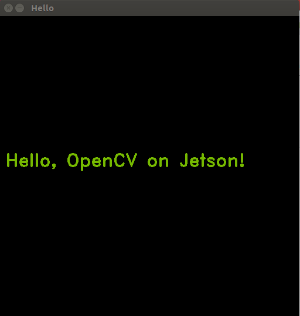

# Episode 0: Introduction to OpenCV

Learn to write your first ‘Hello World’ program on Jetson with OpenCV. You’ll learn a simple compilation pipeline with Midnight Commander, cmake, and OpenCV4Tegra’s mat library, as you build for the first time.

[Video](https://www.youtube.com/watch?v=gvmP0WRVUxI)

This code produce an image with a text:

