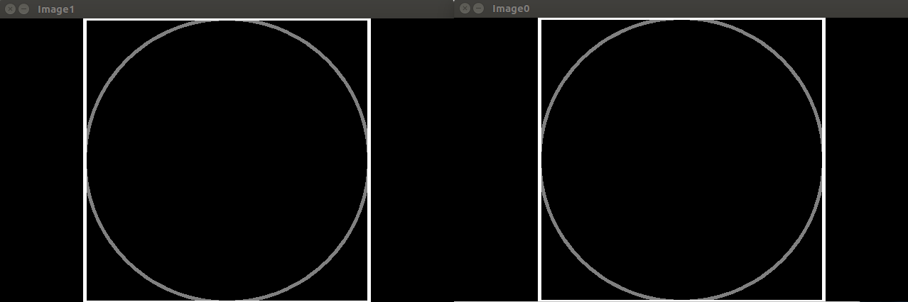

# Episode 1 : CV Mat Container

Learn to work with mat, OpenCV’s primary container. You’ll learn memory allocation for a basic image matrix, then test a CUDA image copy with sample grayscale and color images.

[Video](https://www.youtube.com/watch?v=lQfWANnqmps)

The instructor introduce a few concepts in different steps. 

## Step 1 : Painting a cicle on a gray-scale image

## Step 2 : Demostration of two variable referencing the same image data

## Step 3 : Copying the image

## Step 4 : Colour images

## Step 5 : Working with gray-scale gradient

## Step 6 : Working with colour gradient

