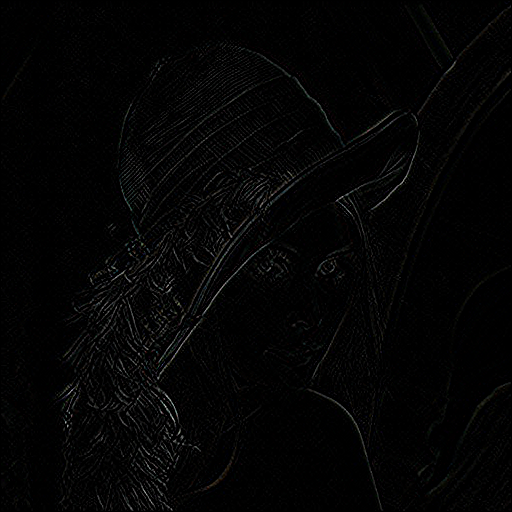

# Episode 2: Multimedia I/O

Learn to manipulate images from various sources: JPG and PNG files, and USB webcams. Run standard filters such as Sobel, then learn to display and output back to file. Implement a rudimentary video playback mechanism for processing and saving sequential frames.

[Video](https://www.youtube.com/watch?v=PEaNXO5SKsE)

The instructor introduce a few concepts in different steps. 

## Step 1 : Showing lena's picture

## Step 2 - 3 : Creating a sobel lena and saving it to disk

## Step 4 - 5 : Loading a video from disk, apply sobel to its frames and saving the video

The video I used was the [SDCND Vehicle Detection project](https://github.com/darienmt/CarND-Vehicle-Detection-P5). The video is [car.mp4](./car.mp4) and the sobel version is [car_sobel.avi](./car_sobel.avi) or you can see it [here](https://youtu.be/5vSalZv8EJU).

<iframe width="560" height="315" src="https://www.youtube.com/embed/5vSalZv8EJU" frameborder="0" allow="autoplay; encrypted-media" allowfullscreen></iframe>

