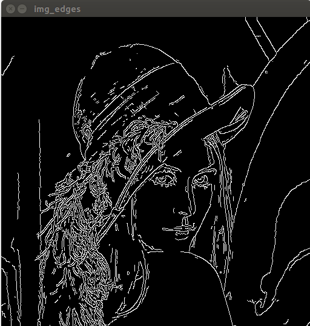
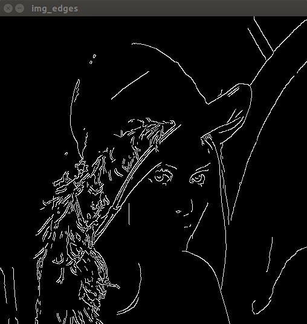
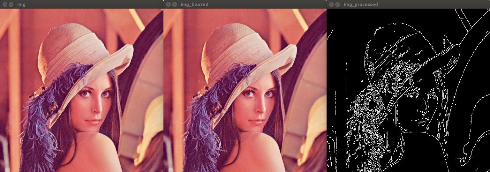
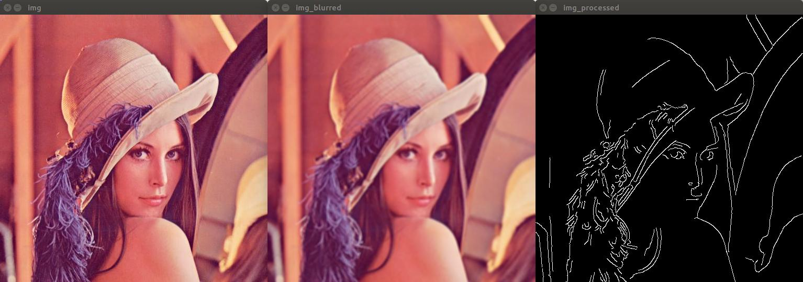
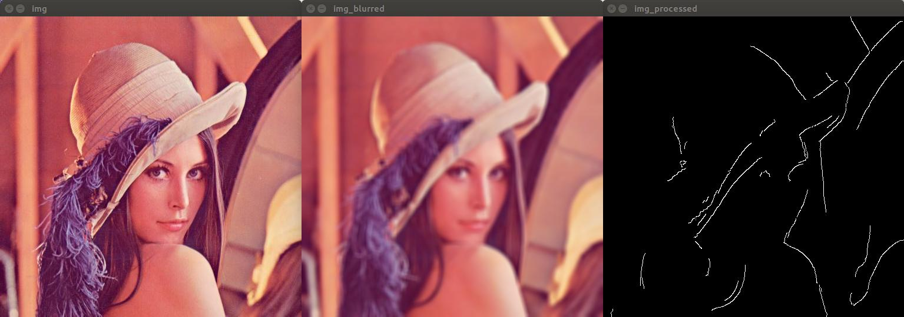

# Episode 3: Basic Operations
Start with an app that displays an image as a Mat object, then resize, rotate it or detect “canny” edges, then display the result. Then, to ignore the high-frequency edges of the image’s feather, blur the image and then run the edge detector again. With higher window sizes, the feather’s edges disappear, leaving behind only the more significant edges present in the input image.

[Video](https://www.youtube.com/watch?v=7bgjQh_Fasg)

## Step 1 : Resizing image

## Step 2 : Rotating image

## Step 3 : Detecting edges with Canny

Increasing threshold

## Step 4 : Detecting edges after blurring with different blur kernel

